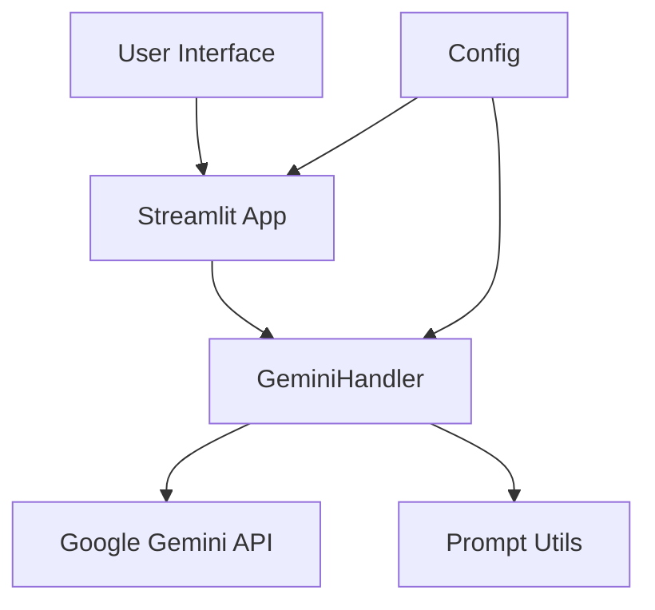

# AI Chat Assistant - Architecture Overview

## System Architecture

## Core Components

### 1. User Interface Layer
- **Technology**: Streamlit
- **Purpose**: Provides a responsive web interface for user interactions
- **Key Features**:
  - Real-time chat interface
  - Message history management
  - Markdown rendering support
  - Error handling display

### 2. Application Layer
- **Main Application** (`src/main.py`)
  - Handles UI rendering and state management
  - Manages chat history
  - Coordinates between UI and business logic

- **Gemini Handler** (`src/gemini_handler.py`)
  - Manages communication with Google's Gemini API
  - Handles response generation
  - Implements safety settings and input validation

### 3. Utility Layer
- **Prompt Utils** (`src/utils/prompt_utils.py`)
  - Manages prompt engineering
  - Handles context creation
  - Formats chat history

### 4. Configuration Layer
- **Config** (`src/config.py`)
  - Centralizes configuration management
  - Handles environment variables
  - Defines system constants

## Data Flow

1. User inputs message through Streamlit interface
2. Input is validated and processed by GeminiHandler
3. Context is created using prompt utils if chat history exists
4. Request is sent to Gemini API
5. Response is processed and formatted
6. UI is updated with the response

## Security Features

- Environment variable management for API keys
- Input validation and sanitization
- Safety settings for content generation
- Error handling and graceful degradation

## Scalability Considerations

- Modular design for easy extension
- Configurable parameters for fine-tuning
- Separation of concerns for maintainability
- Clear interfaces between components 